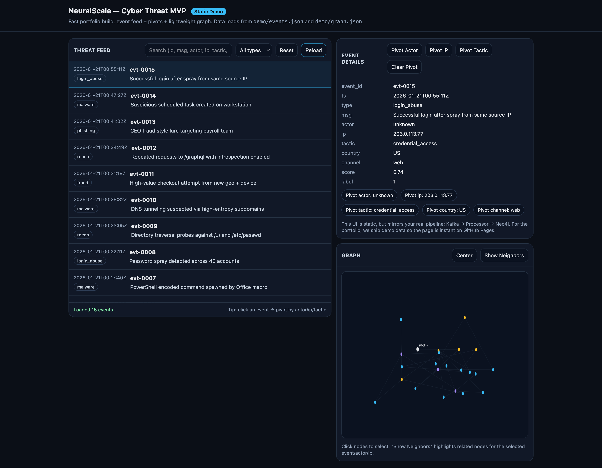

# NeuralScale – Cyber Threat Intelligence MVP

NeuralScale is a portfolio-ready cyber threat intelligence platform built to demonstrate a modern event-driven analytics pipeline using Kafka (Redpanda), Python, Neo4j, and FastAPI.

The project simulates a lightweight Security Operations Center (SOC) workflow that ingests threat events in real time, processes them, stores structured relationships in a graph database, and exposes the data through an API and a static demo interface.

---

---
## 🎯 Project Goal

The goal of NeuralScale is to show the design and implementation of:

- Real-time event ingestion and streaming
- Asynchronous processing pipelines
- Graph-based cyber threat modeling
- Microservice architecture with Docker
- Investigation-style analytics
- Portfolio-friendly visualization

This is not intended as a production SOC platform, but as a strong technical demonstration of backend engineering and system design skills.

---

# 🧩 System Architecture

The system follows a modular event-driven design:

Threat Events → Kafka (Redpanda) → Processor → Neo4j Graph Database
                                           ↘ PostgreSQL
                                            ↘ Redis
                                             ↘ FastAPI
                                              ↘ Static UI

### Technology Stack

| Layer | Technology |
|------|-----------|
| Streaming | Redpanda (Kafka-compatible) |
| Processing | Python + aiokafka |
| Graph Database | Neo4j |
| Relational DB | PostgreSQL |
| Cache | Redis |
| API | FastAPI |
| Deployment | Docker Compose |
| Demo UI | Static HTML/JS on GitHub Pages |

---

# 🔁 What Was Implemented

### 1. End-to-End Streaming Pipeline

- Kafka topic: raw_threat_events
- Python consumer service
- Real-time ingestion
- Automatic persistence into Neo4j
- Event transformation and validation

### 2. Graph Data Model

Threat intelligence is stored using relationships:

(Actor) -[:GENERATED]-> (ThreatEvent) -[:TARGETED]-> (IPAddress)

This allows SOC-style investigations such as:

- Show all events generated by an actor
- Pivot from an IP address to related events
- Analyze tactics and behaviors
- Identify clusters of suspicious activity

---

# 🛠 Data Model

Example event structure:

{
  "event_id": "demo-1",
  "ts": "2026-01-21T01:10:00Z",
  "type": "phishing",
  "msg": "Suspicious login attempt",
  "actor": "APT29",
  "ip": "192.168.1.50",
  "tactic": "credential_access",
  "score": 0.87,
  "country": "US",
  "channel": "email"
}

Fields are normalized and written into Neo4j with consistent relationships and properties.

---

# 🚀 Running the Project Locally

### Prerequisites

- Docker
- Docker Compose
- Optional: Python 3.10+ for utilities

### Start the Full Stack

Clone the repository and run:

```
docker compose up --build
```

This launches:

- Redpanda (Kafka)
- Processor service
- Neo4j graph database
- PostgreSQL
- Redis
- FastAPI service

### Verify the Pipeline

Produce a test event:

```
echo '{"event_id":"demo-test","ts":"2026-01-21T01:30:00Z","type":"demo","msg":"pipeline test"}' \
| docker run --rm -i --network neuralscale_default redpandadata/redpanda:v24.2.7 \
  topic produce raw_threat_events -X brokers=redpanda:9092
```

Query Neo4j to confirm ingestion:

```
docker compose exec neo4j cypher-shell -u neo4j -p neuralscale \
"MATCH (e:ThreatEvent {event_id:'demo-test'}) RETURN e;"
```

If the event appears, the full pipeline is working.

---

# 📊 Static Portfolio Demo

To make the project easy to showcase without running infrastructure, a static demo dataset is included.

Generate static files from sample events:

```
python demo/generate_demo_data.py
```

This produces:

- demo/events.json – list of processed events
- demo/graph.json – nodes and edges for visualization

These files power a GitHub Pages frontend that demonstrates:

- Event list and filtering
- Detail views
- Graph relationships
- Actor/IP pivoting

---

# 🧪 Example Investigation Queries

Find latest events:

```
MATCH (e:ThreatEvent)
RETURN e.event_id, e.ts
ORDER BY e.ts DESC
LIMIT 10;
```

Find all events from a specific actor:

```
MATCH (a:Actor {name:'APT29'})-[:GENERATED]->(e)
RETURN e;
```

Find IPs targeted by high‑score events:

```
MATCH (e:ThreatEvent)-[:TARGETED]->(i:IPAddress)
WHERE e.score > 0.8
RETURN i.value, count(e) as hits;
```

---

# 📁 Repository Structure

```
├── services/
│   ├── ingestion/      # Event collectors
│   ├── processor/      # Kafka consumer
│   └── api/            # FastAPI service
├── infra/
│   └── db/             # Database initialization
├── demo/               # Static portfolio data
├── docker-compose.yml
└── README.md
```

---

# 🌟 What This Project Demonstrates

- Building distributed event pipelines
- Working with Kafka-compatible systems
- Modeling cybersecurity data in graphs
- Designing microservices with Docker
- Integrating multiple data stores
- Creating portfolio-grade technical demos

---

# 🚧 Future Improvements

Potential extensions:

- Machine learning-based event scoring
- Real external threat feed ingestion
- Advanced graph analytics
- Alerting and notifications
- Authentication and role-based access
- Interactive web dashboard

---

# 👤 Author

Built as a personal portfolio project to demonstrate backend engineering, data pipelines, and graph analytics skills.

---

NeuralScale – Turning raw security events into actionable intelligence.

